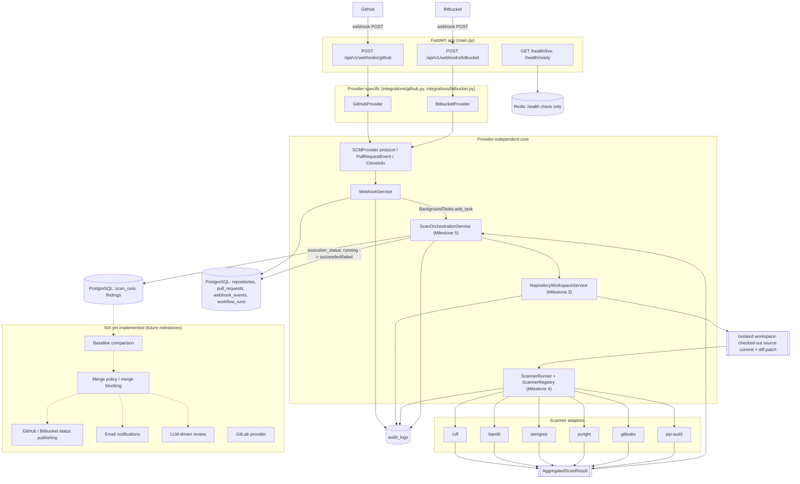

# Project architecture (through Milestone 5)

This describes the system as it exists in the repository today, through Milestone 5.
It does not describe aspirational or planned functionality except where explicitly
marked "not yet implemented." For milestone-by-milestone detail and security notes, see
`docs/architecture/milestone-{2,3,4,5}.md` (Milestone 1 is `docs/architecture/v1.md`,
currently an empty placeholder file in this repository).

See also: [MILESTONE_GUIDELINES.md](MILESTONE_GUIDELINES.md),
[PROJECT_STATE.md](../../PROJECT_STATE.md).

## Layers

1. **FastAPI application** (`src/protecto_prime_agent/main.py`) -- the single HTTP
   entry point. Registers the webhooks router, a correlation-ID middleware, and two
   health endpoints.
2. **Webhook ingestion** (`src/protecto_prime_agent/api/v1/webhooks.py`,
   `services/webhook_service.py`) -- receives and persists pull request events.
3. **SCM provider abstraction** (`src/protecto_prime_agent/integrations/`) -- isolates
   everything GitHub- or Bitbucket-specific behind one `SCMProvider` protocol.
4. **Repository workspace preparation** (`services/repository_workspace_service.py`) --
   clones the exact source commit into an isolated workspace (Milestone 3).
5. **Scanner runtime** (`src/protecto_prime_agent/scanners/`) -- runs six static
   analysis tools against that workspace and normalizes their output (Milestone 4).
6. **Scan orchestration** (`services/scan_orchestration_service.py`) -- wires layers 2,
   4, and 5 together: scheduled as a FastAPI background task once a webhook is
   accepted, it runs workspace preparation then the scanner runtime and persists the
   results (Milestone 5).
7. **Persistence** -- PostgreSQL (via SQLAlchemy async + Alembic) and an `AuditLog`
   table written to from the webhook, workspace/scanner, and orchestration layers.
8. **Redis** -- currently used only for a health check (`redis_client.py`); reserved
   for future job orchestration (see "Not yet implemented" below).

## Webhook ingestion

`POST /api/v1/webhooks/bitbucket` and `POST /api/v1/webhooks/github`
(`api/v1/webhooks.py`) each:

1. Read the raw request body (before any parsing) and reject bodies over 1 MB.
2. Construct the matching provider (`BitbucketProvider`/`GitHubProvider`) with its
   webhook secret from `Settings`.
3. Delegate to `WebhookService.handle_webhook(body, signature, correlation_id,
   background_tasks)`, passing through FastAPI's injected `BackgroundTasks`
   (Milestone 5).

`WebhookService` (`services/webhook_service.py`) is provider-agnostic: it only calls
the `SCMProvider` protocol methods, never anything GitHub/Bitbucket-specific directly.
It:

1. Validates the webhook signature via the provider.
2. Parses the payload into a normalized `PullRequestEvent` via the provider; unsupported
   events return `{"status": "ignored"}` without persisting anything.
3. Deduplicates by provider event ID (falling back to a payload hash) against
   `WebhookEvent` rows -- a duplicate returns `{"status": "duplicate"}`.
4. Persists/updates `Repository` and `PullRequest` rows, inserts a `WebhookEvent` row,
   creates a `WorkflowRun` row (`execution_status=queued`), and writes an
   `AuditLog` row (`action=webhook_ingested`) -- all in one transaction.
5. **(Milestone 5)** If `background_tasks` was provided and the event was newly
   accepted (not a duplicate or ignored), schedules
   `ScanOrchestrationService.run` as a background task -- after the HTTP response is
   already sent, never blocking the webhook acknowledgement. Callers that omit
   `background_tasks` (e.g. direct unit tests) get Milestone 2's original
   webhook-only behavior with no orchestration triggered.

## GitHub and Bitbucket provider abstraction

`SCMProvider` (`integrations/scm.py`) is a `Protocol` with three methods:
`validate_webhook`, `parse_pull_request_event`, `get_clone_info`. `GitHubProvider`
(`integrations/github.py`) and `BitbucketProvider` (`integrations/bitbucket.py`) each
implement it independently:

- **Signature validation**: GitHub supports `sha1=`/`sha256=`-prefixed HMAC signatures;
  Bitbucket uses a bare HMAC-SHA256 hex digest. Both use `hmac.compare_digest`
  (constant-time comparison).
- **Payload parsing**: each provider's `parse_pull_request_event` validates every field
  it needs (action/event type, PR id, branches, commit SHAs, repository id, repository
  full name) and returns `None` if the payload doesn't match a supported shape or
  target branch (`main`/`master`/`develop`) -- never raises on a malformed/unsupported
  payload.
- **Clone info**: `get_clone_info` builds the real clone URL from the payload's own
  `repository_full_name` (e.g. `https://github.com/octo-org/demo-repo.git`,
  `https://bitbucket.org/octo-workspace/demo-repo.git`) -- never a placeholder host.

`SCMProviderType` (`integrations/scm.py`) also enumerates `GITLAB`, but there is no
`GitLabProvider` implementation yet -- **not yet implemented**.

## Normalized pull request events

`PullRequestEvent` (`integrations/scm.py`) is the one shape every downstream component
(`WebhookService`, and transitively `RepositoryWorkspaceService`) depends on:
`event_type`, `repository_id`, `pull_request_id`, `source_branch`, `target_branch`,
`source_commit_sha`, `target_commit_sha`, `repository_full_name`, `provider_event_id`.
Nothing downstream of this dataclass needs to know which provider produced it.

`CloneInfo` (`integrations/scm.py`) is the analogous provider-specific-to-generic
handoff for cloning: `clone_url`, `repository_name`, and an optional ephemeral
`access_token`/`access_username` for private-repository authentication (see below).

## Repository workspace preparation (Milestone 3)

`RepositoryWorkspaceService` (`services/repository_workspace_service.py`) takes an
`SCMProvider`, a `PullRequestEvent`, and a workflow run id, and produces an isolated,
on-disk workspace containing the source commit checked out in detached HEAD mode plus a
generated diff. It is entirely provider-agnostic: its only provider-specific input is
whatever `CloneInfo` the provider returns.

### Secure clone and fetch flow

1. Validate both commit SHAs (40-hex-character pattern) and build a path-escape-checked
   workspace directory under `WORKSPACE_ROOT`
   (`<repo_id>/<pr_id>/<source_sha>/<workflow_run_id>`).
2. Validate the clone URL (`https://`/`http://`/`file://` only; rejects any URL
   containing embedded credentials).
3. Check available disk space against `MAX_WORKSPACE_SIZE_MB` before fetching anything.
4. `git init` + `git remote add origin <url>`, then fetch the **source** commit with
   `GIT_CLONE_TIMEOUT_SECONDS` and bounded retries.
5. Fetch the **target** commit with the separate `GIT_FETCH_TIMEOUT_SECONDS`.
6. Verify both commits exist (`git rev-parse --verify`); re-check workspace size.
7. `git checkout --detach <source_sha>`.
8. `git diff --unified=20 <target_sha> <source_sha>` -> `diff.patch`.

Every git invocation uses an explicit argument list, `shell=False`, disables
`credential.helper`, and sets `GIT_TERMINAL_PROMPT=0`. When `CloneInfo.access_token` is
present, it is passed to git only via a per-fetch, ephemeral `GIT_ASKPASS` helper script
(secret-free itself; the token lives only in the subprocess environment) that is
deleted immediately after the fetch. All captured git output is passed through
`redact_secrets` before being logged, stored in an audit event, or raised. See
[docs/architecture/milestone-3.md](../architecture/milestone-3.md) for the full design.

Cleanup: failure always cleans up the workspace immediately;
`mark_processing_complete(workspace_path)` cleans up immediately if
`WORKSPACE_RETENTION_HOURS<=0`, otherwise retains it for `cleanup_stale_workspaces` to
reap later.

## Scanner runtime (Milestone 4)

`ScannerRunner` (`scanners/runner.py`), backed by `ScannerRegistry`
(`scanners/registry.py`) and `ScannerRuntimeConfig` (`scanners/config.py`), takes a
`ScanRequest` (a workspace path, commit sha, workflow run id, repository id, and an
optional per-call scanner allowlist) and runs every enabled adapter concurrently,
isolated from each other's failures, returning an in-memory `AggregatedScanResult`. It
has no dependency on `integrations/` or `services/` -- it only needs a workspace
directory that already contains a checked-out commit, which is exactly what
`RepositoryWorkspaceService.prepare_workspace` produces.

Execution goes through a swappable `ExecutionBackend`
(`scanners/execution.py`): `LocalProcessExecutionBackend` (used today, in tests and for
local development) or `ContainerExecutionBackend` (constructs, and can run, a hardened
`docker run` invocation -- no docker socket mount, read-only workspace mount, dropped
capabilities, resource limits, minimal environment; no scanner container images are
built yet, so this backend is not exercised end-to-end).

## Scanner adapters

Six adapters (`scanners/adapters/`), each translating between the common
`ScannerAdapter` interface and one tool's own CLI/output format:

| Adapter | Tool | Category produced |
|---------|------|---------------------|
| `RuffAdapter` | ruff | style, quality, security |
| `BanditAdapter` | bandit | security |
| `SemgrepAdapter` | semgrep (offline, package-local ruleset) | security |
| `PyrightAdapter` | pyright | typing |
| `GitleaksAdapter` | gitleaks | secret |
| `PipAuditAdapter` | pip-audit | dependency |

Every adapter's `build_command` is a fixed argument list (never templated from
repository content); output is parsed into `NormalizedFinding` objects with a stable,
commit-independent `fingerprint`. See
[docs/architecture/milestone-4.md](../architecture/milestone-4.md) for the full
per-tool severity/category/confidence mapping and the security model (minimal
subprocess environment, secret redaction, resource limits).

## Scan orchestration (Milestone 5)

`ScanOrchestrationService` (`services/scan_orchestration_service.py`) is the glue
between the three layers above. Given the `SCMProvider`/`PullRequestEvent` the webhook
layer already parsed and the `WorkflowRun`/`PullRequest`/`Repository` ids it created,
`run()`:

1. Marks `WorkflowRun`/`PullRequest.execution_status = running`.
2. Calls `RepositoryWorkspaceService.prepare_workspace` (Milestone 3). A failure here
   marks the workflow `failed` and stops -- the scanner runtime is never invoked.
3. Calls `ScannerRunner.run_scan` (Milestone 4) against the prepared workspace. A
   crash here (not an individual adapter reporting `FAILED`/`TIMEOUT`, which
   `ScannerRunner` already isolates per Milestone 4) also marks the workflow `failed`,
   but the workspace is still explicitly cleaned up.
4. Persists the `AggregatedScanResult` to `ScanRun` (one row per scanner) and `Finding`
   (one row per normalized finding).
5. Calls `RepositoryWorkspaceService.mark_processing_complete` to clean up (or retain
   per `WORKSPACE_RETENTION_HOURS`) the workspace.
6. Marks `WorkflowRun`/`PullRequest.execution_status = succeeded`.

It depends on `RepositoryWorkspaceService` and `ScannerRunner` only through two
minimal local `Protocol` interfaces (`WorkspacePreparer`, `ScanExecutor`), so neither
Milestone 3 nor Milestone 4 code needed to change. `WebhookService` schedules this via
FastAPI `BackgroundTasks` -- there is no message queue in this project; see
[docs/architecture/milestone-5.md](../architecture/milestone-5.md) for the full
rationale, status-transition table, and remaining risks (no durable queue, no retry,
no concurrency limit).

## Audit flow

`RepositoryWorkspaceService`, `ScannerRunner`, and `ScanOrchestrationService` all write
to the same `AuditLog` table (`models/audit_log.py`) through an **injectable writer**
pattern: an `AuditWriter` protocol/base class with a `SqlAuditWriter` production
implementation. `scanners/audit.py` keeps its own independent copy so the scanner
runtime has no import dependency on the `services` package; `ScanOrchestrationService`
reuses the copy already defined in `services/repository_workspace_service.py` rather
than adding a third. All writers are best-effort: a failure to write an audit row is
caught, logged as a sanitized structured event, and never blocks the underlying
operation (workspace prep, a scan, or orchestration). `WebhookService` writes to the
same table directly (not through the injectable-writer pattern, since it already holds
an open transaction).

Every audit row has `entity_type`, `entity_id`, `action`, `actor`, `metadata_json`
(itself passed through the same redaction function used for logs), and `created_at`.

## PostgreSQL

Accessed exclusively through SQLAlchemy's async engine (`database.py`,
`asyncpg` driver). `init_db()` (called from the FastAPI `lifespan`) runs
`Base.metadata.create_all` at startup -- so a fresh database gets all current model
tables automatically. Alembic (`alembic.ini`, `alembic/versions/001_initial_schema.py`)
also exists and defines the same schema as a versioned migration; there is currently no
`make` target wired to it (see
[docs/deployment/LOCAL_SETUP.md](../deployment/LOCAL_SETUP.md) for the exact command).
Ten tables exist today: `repositories`, `pull_requests`, `webhook_events`,
`workflow_runs`, `scan_runs`, `findings`, `policy_decisions`, `reports`,
`notifications`, `audit_logs`. As of Milestone 5, `ScanOrchestrationService` writes
`scan_runs` and `findings` rows from every orchestrated scan. `policy_decisions`,
`reports`, and `notifications` remain defined (created in Milestone 1, in anticipation
of later milestones) but **not yet written to by any current code path**.

## Redis

`redis_client.py` connects via `redis.asyncio` and is used only by
`GET /health/ready`, which returns HTTP 503 if Redis is unreachable. There is no job
queue, cache, or pub/sub usage yet -- **not yet implemented**.

## FastAPI

`main.py` builds one `FastAPI` app with a `lifespan` that calls `init_db()`, a
correlation-ID middleware (reads `X-Correlation-ID`, defaults to a generated value,
echoes it back on the response), the webhooks router, and two health endpoints
(`/health/live` always `200`, `/health/ready` depends on Redis).

## Provider-specific vs. provider-independent boundary

This boundary is enforced deliberately at two points in the codebase:

- `integrations/github.py` and `integrations/bitbucket.py` are the **only** places that
  know about GitHub- or Bitbucket-specific payload shapes, header names, or URL
  conventions. Everything downstream (`WebhookService`, `RepositoryWorkspaceService`,
  the entire `scanners/` package) works only in terms of `PullRequestEvent`,
  `CloneInfo`, and a plain workspace directory path.
- The scanner runtime additionally has zero dependency on `integrations/` or
  `services/` at all -- it is provider-agnostic in the stronger sense that it doesn't
  even know a pull request or webhook exists; it only knows "here is a directory with a
  commit checked out."

## Architecture diagram

## Not yet implemented (explicitly out of scope through Milestone 5)

- **GitLab provider** -- `SCMProviderType.GITLAB` is enumerated but has no provider
  implementation.
- **Baseline comparison** -- comparing a scan's findings against a prior scan/commit.
- **Merge policy / merge blocking** -- `PolicyDecision` model exists, unused;
  `PullRequest.merge_decision` and `Finding.policy_blocking` stay at their defaults.
- **GitHub/Bitbucket status/check publishing** -- no code posts a commit status or
  check run to either provider.
- **Email notifications** -- `Notification` model exists, unused.
- **LLM-driven review** -- no LLM integration anywhere in the codebase.
- **Scanner container images** -- `ContainerExecutionBackend` exists and is unit-tested
  for the safety of the `docker run` invocation it builds, but no
  `protecto-scanner-<tool>:<version>` images have been built, and no
  `docker-compose.yml` service runs scanners in containers today;
  `ScanOrchestrationService`'s default scanner runner uses
  `LocalProcessExecutionBackend`.
- **Durable orchestration queue** -- Milestone 5 schedules orchestration via FastAPI's
  in-process `BackgroundTasks`, not a message queue; there is no retry, no persisted
  work queue, and no concurrency limit across simultaneous scans. See
  [docs/architecture/milestone-5.md](../architecture/milestone-5.md#remaining-risks--known-limitations).
